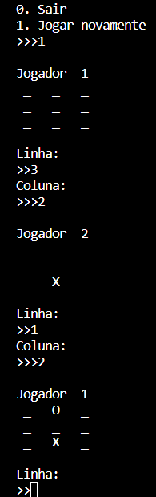

# JOGO DA VELHA
👨‍💻ESSE É PEQUENO JOGO QUE RODA NO CONSOLE DA IDE.

 <br>

## DESCRIÇÃO:
O aplicativo é um jogo da velha simples para dois jogadores. Suas principais funcionalidades são:

1. **Menu de Opções:**
   - Permite aos jogadores escolherem entre sair do jogo ou jogar novamente.

2. **Tabuleiro Interativo:**
   - Exibe um tabuleiro 3x3 na tela, onde os jogadores fazem suas jogadas alternadamente.

3. **Entrada de Jogadas:**
   - Solicita que os jogadores informem as coordenadas (linha e coluna) para realizar suas jogadas.

4. **Verificação de Vitória:**
   - Avalia se um jogador venceu o jogo ao completar uma linha, coluna ou diagonal com suas marcações.

5. **Empate:**
   - Identifica quando o jogo resulta em um empate (nenhum jogador venceu e o tabuleiro está cheio).

6. **Exibição do Tabuleiro Atualizado:**
   - Mostra o estado atual do tabuleiro após cada jogada.

7. **Loop de Jogo:**
   - Permite que os jogadores continuem jogando até que haja um vencedor ou empate.

## COMO USAR?
**Passo 1:** Clone o repositório para o seu sistema local.

```bash
git clone https://github.com/VILHALVA/JOGO-DA-VELHA-EXE.git
```

**Passo 2:** Navegue até o diretório do projeto.

```bash
cd JOGO-DA-VELHA-EXE
```

**Passo 3:** Descompacte o arquivo ZIP (se você baixou manualmente):

```bash
unzip JOGO-DA-VELHA-EXE.zip
```

**Passo 4:** Execute o executável do projeto.

```bash
./JOGO-DA-VELHA
```

## CREDITOS:
- [PROJETO CRIADO PELO VILHALVA](https://github.com/VILHALVA)
