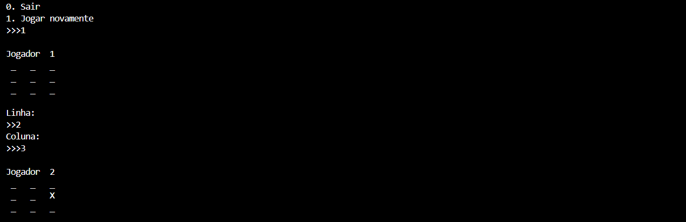

# JOGO DA VELHA - EXE
👨‍💻ESSE É PEQUENO JOGO QUE RODA NO CONSOLE DA IDE.

 <br>

## DESCRIÇÃO:
O aplicativo é um jogo da velha simples para dois jogadores. Suas principais funcionalidades são:

1. **Menu de Opções:**
   - Permite aos jogadores escolherem entre sair do jogo ou jogar novamente.

2. **Tabuleiro Interativo:**
   - Exibe um tabuleiro 3x3 na tela, onde os jogadores fazem suas jogadas alternadamente.

3. **Entrada de Jogadas:**
   - Solicita que os jogadores informem as coordenadas (linha e coluna) para realizar suas jogadas.

4. **Verificação de Vitória:**
   - Avalia se um jogador venceu o jogo ao completar uma linha, coluna ou diagonal com suas marcações.

5. **Empate:**
   - Identifica quando o jogo resulta em um empate (nenhum jogador venceu e o tabuleiro está cheio).

6. **Exibição do Tabuleiro Atualizado:**
   - Mostra o estado atual do tabuleiro após cada jogada.

7. **Loop de Jogo:**
   - Permite que os jogadores continuem jogando até que haja um vencedor ou empate.

## EXECUTANDO O JOGO:
1. Execute o código em um ambiente Python.
2. Quando você executar o jogo, ele exibirá um tabuleiro vazio no console.
3. O jogo solicitará que os jogadores façam suas jogadas, alternando entre X e O.
4. Você será solicitado a inserir a linha e coluna onde deseja colocar sua marca (X ou O).
5. Insira a linha desejada (1, 2 ou 3) e pressione Enter.
6. Em seguida, insira a coluna desejada (1, 2 ou 3) e pressione Enter.
7. O jogo exibirá o tabuleiro atualizado com sua jogada.
8. Continue alternando entre os jogadores até que um jogador vença ou haja um empate.
9. O jogo terminará quando um jogador vencer ou não houver mais jogadas disponíveis.
10. Após o término do jogo, você terá a opção de jogar novamente ou sair do jogo.

## SOBRE O EXECUTAVEL:
### 1. EXECUTANDO:
   - Este arquivo executável está disponível apenas para `Windows X64`. Para executá-lo, basta dar dois cliques. O executável é bastante útil caso o Python não esteja instalado. Trata-se da mesma aplicação do arquivo `CODIGO.py`. Se desejar, você pode recompilá-lo novamente; é para isso que forneci o arquivo `imagem.ico`.

### 2. GERANDO:
   **1. Instalação do [PyInstaller:](https://pyinstaller.org/en/stable/)**
   - Certifique-se de ter o PyInstaller instalado. Se não tiver, instale usando o comando abaixo:
   ```bash
   pip install pyinstaller
   ```

   **2. Gerando o Executável:**
   - Para gerar o executável, utilize o comando `pyinstaller` seguido de opções:
      - `--icon="imagem.ico"`: Especifica o ícone do executável.
      - `-F`: Gera um único arquivo executável em vez de vários.
      - `CODIGO.py`: Substitua "CODIGO.py" pelo nome do seu arquivo Python principal.
   ```bash
   pyinstaller --icon="imagem.ico" -F CODIGO.py
   ```

## NÃO SABE?
- Entendemos que para manipular arquivos em muitas linguagens e tecnologias, é necessário possuir conhecimento nessas áreas. Para auxiliar nesse aprendizado, oferecemos cursos gratuitos disponíveis:
* [CURSO DE PYTHON](https://github.com/VILHALVA/CURSO-DE-PYTHON)
* [CONFIRA MAIS CURSOS](https://github.com/VILHALVA?tab=repositories&q=+topic:CURSO)

## CREDITOS:
- [PROJETO CRIADO PELO VILHALVA](https://github.com/VILHALVA)
